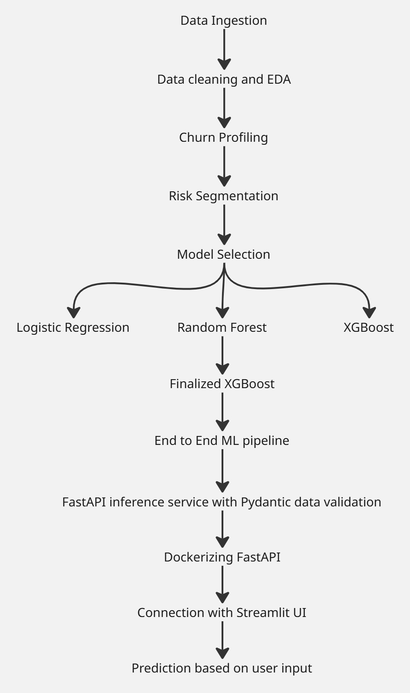

# Production Ready Credit Card Churn Prediction System

**End-to-End ML Pipeline | FastAPI | Streamlit | Docker | XGBoost**

---

## Project Overview

This project implements a **production-ready, end-to-end customer churn prediction system**, starting from raw data ingestion to real-time predictions via a web interface.

The system covers the **entire machine learning lifecycle**:
- Data ingestion and exploration
- Churn profiling and risk segmentation
- Model comparison and selection
- End-to-end ML pipeline creation
- API-based inference
- UI integration and Dockerized deployment

---

## Project Workflow



---

## Key Features

- End-to-end **production-grade ML pipeline**
- Custom **sklearn transformers**
- **XGBoost** with categorical feature support
- **Strict request validation** using Pydantic
- Modular, scalable project structure
- **Dockerized FastAPI** backend
- Interactive **Streamlit frontend**

---

## Project Structure

```
churn_prediction_system/
│
├── models/
│   └── xgb_churn_pipeline.pkl
│
├── preprocessing.py
├── app.py
├── streamlit_app.py
│
├── 01_Churn_Profiling_&_Retention_Analysis.ipynb
├── 02_Churn_Prediction.ipynb
│
├── requirements.txt
├── requirements_exact.txt
├── Dockerfile
├── .dockerignore
└── README.md
```

---

## Churn Profiling & Retention Analysis  
**`01_Churn_Profiling_&_Retention_Analysis.ipynb`**

- Customer behavior analysis
- Churn vs non-churn segmentation
- Retention insights and business impact

### Highlights & Insights
- **Baseline churn rate:** ~**16%**
- **Risk segmentation:**  
  - **High-Risk customers (~37%)** contribute ~**64% of churners**  
  - High-Risk churn ≈ **28%** vs **~9%** for Low-Risk
- **Top churn drivers:**  
  - **Transaction count**
  - **Total transaction amount**
  - **Total revolving balance**
- **Behavioral signals:**  
  - **4+ inactive months** → sharp churn increase  
  - **4+ bank contacts** → strong dissatisfaction signal  
  - **4+ product holders** → significantly lower churn
---

## Churn Prediction & Modeling  
**`02_Churn_Prediction.ipynb`**

Three supervised models were trained on the engineered dataset  
(encoding + selective scaling; class imbalance considered).

- **Logistic Regression** – served as a baseline; while it captured most churners (high recall), class imbalance caused over-prediction of churn, making it unsuitable for deployment.
- **Random Forest** – strong uplift over baseline; reliable mid-complexity model with high accuracy and good churn recall.
- **XGBoost** – best overall; achieved the strongest balance between churn recall and precision while maintaining very high accuracy.  

## Metrics (test set)

| Model | Precision (0) | Recall (0) | F1 (0) | Precision (1) | Recall (1) | F1 (1) | Accuracy |
|------|---------------|------------|--------|---------------|------------|--------|----------|
| Logistic Regression | 0.96 | 0.86 | 0.91 | 0.53 | 0.82 | 0.64 | 0.85 |
| Random Forest | 0.95 | 0.99 | 0.97 | 0.93 | 0.74 | 0.83 | 0.95 |
| **XGBoost** | **0.98** | **0.99** | **0.98** | **0.92** | **0.89** | **0.91** | **0.97** |


> **Conclusion:** XGBoost delivers the best trade-off between churner recall and overall accuracy.

---

## Machine Learning Pipeline

The saved pipeline (`xgb_churn_pipeline.pkl`) contains:

- Custom preprocessing:
  - Text standardization (lowercasing, trimming)
  - Categorical casting
- Feature transformations
- XGBoost classifier

All preprocessing and modeling logic is **bundled into a single pipeline**, ensuring consistent training and inference behavior.

---

## FastAPI Inference Service

### Input Validation

- Strong type enforcement
- Range checks
- Categorical value validation
- Automatic error handling

### Endpoint

```
POST /predict
```

**Response Example**
```json
{
  "attrition_prediction": 1,
  "attrition_probability": 0.8234
}
```

---

## Streamlit Frontend

### Features

- Clean and interactive UI
- User-driven input form
- Real-time API communication
- Clear churn probability visualization

### Communication Flow

```
Streamlit UI → FastAPI → ML Pipeline → Prediction → UI
```

---

## Dockerization

The FastAPI inference service is fully containerized.

**Pull the docker image from docker hub**

```bash
docker pull bholebaba902/churn-api
```

**Run the container**

```bash
docker run -p 8000:8000 churn-api
```

**API available at:**
```
http://127.0.0.1:8000
```

---

### Start Streamlit App

```bash
streamlit run streamlit_app.py
```

UI available at:
```
http://localhost:8501
```
---
## Power BI Dashboard
**Tabs:** Executive KPIs · Demographics · Products · Engagement · Risk

**KPIs include:**
- Overall Churn Rate
- Churn by Risk Segment
- Churn by Gender / Income / Education
- Churn by Card Category
- Churn by Products Held
- Churn by Inactivity Months
- Churn by Contact Frequency


---

## Tech Stack

- Python
- SQL
- Pandas / NumPy
- Scikit-learn
- XGBoost
- FastAPI
- Pydantic
- Streamlit
- Docker
- SHAP (optional explainability)
- Power BI

---

## Business Value

- Early identification of high-risk churn customers
- Data-driven retention strategy enablement
- Deployable real-time prediction system
- Easily extensible for monitoring and explainability

---

## Future Enhancements

- SHAP-based explainability in UI
- Model monitoring and drift detection
- Authentication and access control
- Cloud deployment (AWS / GCP / Azure)

---

## Author

**Dev Bhalodia**  
Data Science | Machine Learning | Production ML Systems
